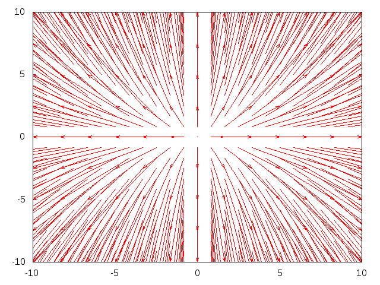

# CommonDoc gnuplot

Render gnuplot plots from source code.

# Overview

This contrib provides a macro for turning gnuplot commands into images.

# Examples

## Direction Field

Scriba input:

```
@begin[path=dir-field.png](gnuplot)
@begin(verb)
set xrange [-10:10]
set yrange [-10:10]
set samples 25
set isosamples 25
dx(x) = x
dy(x) = 2*x
plot "++" using 1:2:(dx($1)):(dy($2)) w vec
@end(verb)
@end(gnuplot)
```

Output:



# License

Copyright (c) 2015 Fernando Borretti

Licensed under the MIT License.
